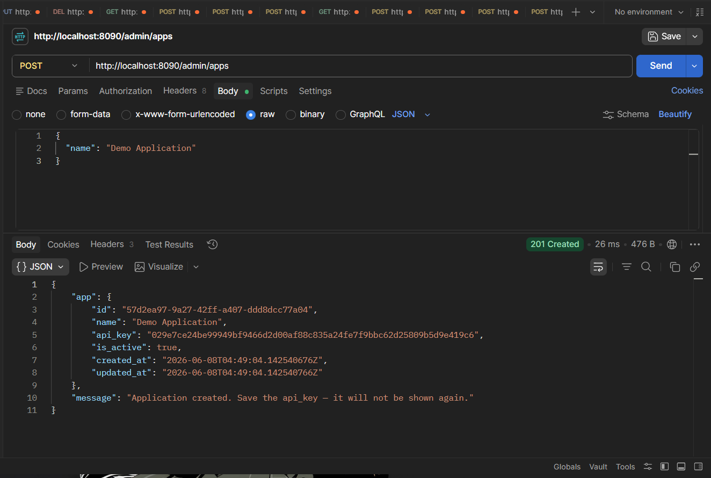
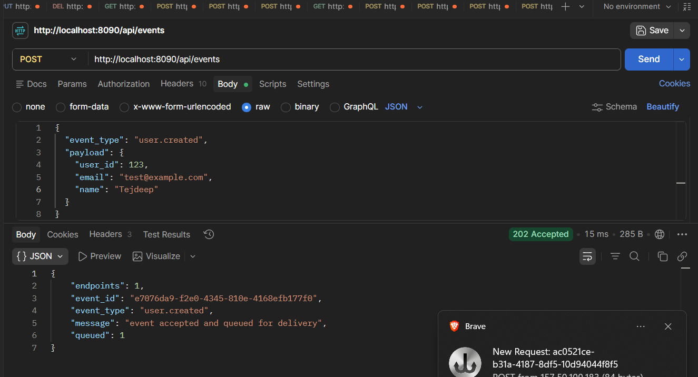
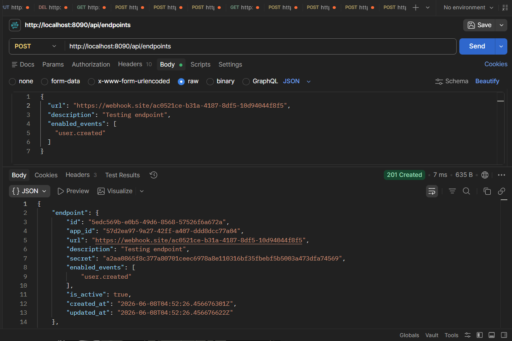
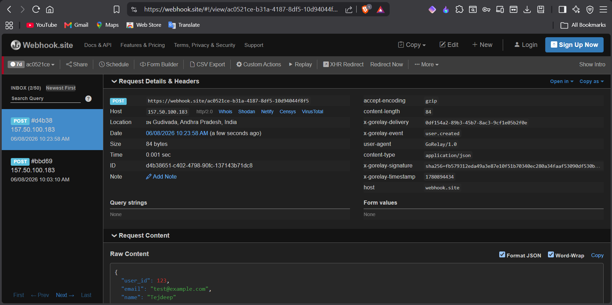
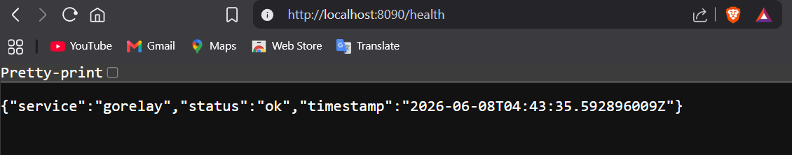

# GoRelay

A production-style webhook delivery engine built with Go, Gin, PostgreSQL, Redis, and Docker.

GoRelay enables applications to publish events that are delivered asynchronously to registered webhook endpoints through Redis-backed queues, concurrent worker pools, retry mechanisms, HMAC signatures, and Dead Letter Queue (DLQ) handling.

---

## Features

### Event-Driven Architecture

* Publish events through a REST API
* Fan-out delivery to multiple webhook endpoints
* Asynchronous processing using Redis queues
* Concurrent goroutine worker pool

### Reliability

* Exponential backoff retries
* Delayed job scheduling
* Dead Letter Queue (DLQ) for failed deliveries
* Delivery status tracking
* Graceful worker shutdown

### Security

* API Key Authentication
* HMAC-SHA256 webhook signatures
* Per-endpoint signing secrets
* Request verification support

### Observability

* Delivery metrics
* Queue depth monitoring
* DLQ monitoring
* Success rate tracking
* Health check endpoint

### Infrastructure

* PostgreSQL persistence
* Redis-backed queues
* Dockerized services
* Docker Compose orchestration

---

## Architecture

```text
                 ┌───────────────┐
                 │   API Client  │
                 └───────┬───────┘
                         │
                         ▼
                 POST /api/events
                         │
                         ▼
                 ┌───────────────┐
                 │  PostgreSQL   │
                 │ Event Storage │
                 └───────┬───────┘
                         │
                         ▼
                 ┌───────────────┐
                 │  Redis Queue  │
                 └───────┬───────┘
                         │
                         ▼
              ┌─────────────────────┐
              │   Worker Pool       │
              │  Goroutine Workers  │
              └─────────┬───────────┘
                        │
                        ▼
              ┌─────────────────────┐
              │ Webhook Endpoints   │
              └─────────┬───────────┘
                        │
          ┌─────────────┴─────────────┐
          ▼                           ▼
     Success                    Retry Logic
                                     │
                                     ▼
                             Dead Letter Queue
```

---

## Tech Stack

### Backend

* Go
* Gin

### Database

* PostgreSQL

### Queue System

* Redis

### Security

* API Keys
* HMAC-SHA256 Signatures

### Infrastructure

* Docker
* Docker Compose

---

## Project Structure

```text
GoRelay/
│
├── internal/
│   ├── config/
│   ├── db/
│   ├── handlers/
│   ├── middleware/
│   ├── models/
│   ├── queue/
│   ├── repository/
│   └── worker/
│
├── migrations/
│   └── 001_initial.sql
│
├── Dockerfile
├── docker-compose.yml
├── go.mod
├── go.sum
└── main.go
```

---

## Running Locally

### Clone Repository

```bash
git clone https://github.com/TejdeepKodati/go-relay.git
cd gorelay
```

### Start Services

```bash
docker compose up --build
```

Services:

```text
API         → http://localhost:8090
PostgreSQL  → localhost:5433
Redis       → localhost:6380
```

---

## Health Check

```http
GET /health
```

Response:

```json
{
  "service": "gorelay",
  "status": "ok"
}
```

---

## API Workflow

### 1. Create Application

```http
POST /admin/apps
```

Returns:

* Application ID
* API Key

---

### 2. Register Webhook Endpoint

```http
POST /api/endpoints
```

Header:

```text
X-API-Key: YOUR_API_KEY
```

Stores:

* Endpoint URL
* Enabled Events
* Signing Secret

---

### 3. Publish Event

```http
POST /api/events
```

Example:

```json
{
  "event_type": "user.created",
  "payload": {
    "user_id": 123,
    "email": "test@example.com"
  }
}
```

---

### 4. Delivery Pipeline

```text
Event
 ↓
Store in PostgreSQL
 ↓
Push Job to Redis Queue
 ↓
Worker Picks Job
 ↓
Sign Payload (HMAC)
 ↓
Send Webhook Request
 ↓
Success / Retry / DLQ
```

---

## Retry Strategy

GoRelay automatically retries failed webhook deliveries using exponential backoff.

```text
Attempt 1 → 5 seconds
Attempt 2 → 30 seconds
Attempt 3 → 5 minutes
Attempt 4 → 30 minutes
```

Failed deliveries beyond the configured retry limit are moved to the Dead Letter Queue.

---

## Metrics

```http
GET /api/metrics
```

Provides:

* Total Events
* Total Deliveries
* Success Rate
* Queue Depth
* DLQ Depth
* Delivery Status Breakdown

---

## Screenshots

### Dashboard / API Testing



### Event Ingestion



### End Point


### Webhook Delivery



### Health check



---

## Future Improvements

* Web Dashboard
* Endpoint Secret Rotation
* Rate Limiting
* Event Replay
* Delivery Logs Search
* Kubernetes Deployment
* Prometheus Metrics
* OpenTelemetry Tracing

---

## Author

**Tejdeep Kodati**

Built to explore distributed systems, event-driven architecture, webhook delivery pipelines, Redis queues, concurrency patterns, and reliable background processing in Go.
